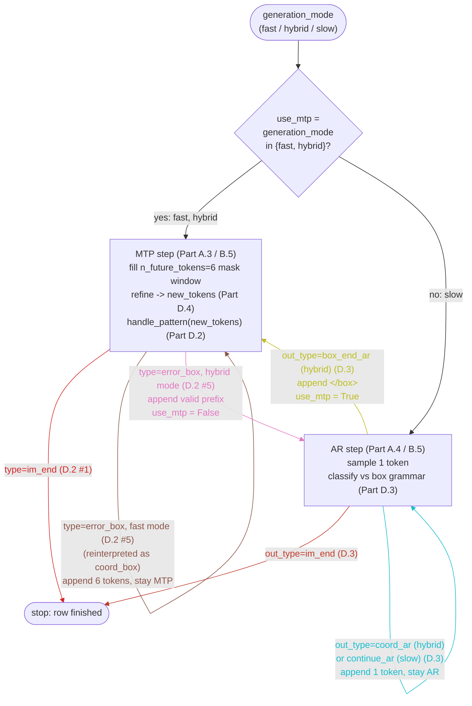

# LocateAnything decoding, before and after batching

This is a from-the-ground-up walkthrough of the decoder this PR changes: how the
original `B==1` hybrid MTP/AR loop in `modeling_locateanything.py::generate()`
works, step by step with concrete numbers, and how `batched_generate.py`
generalizes every piece of it to `B>1`. It is reference material, not part of the
PR description.

Everything below is the *decoding loop and KV-cache mechanics* — the part this PR
rewrites. The token-level sampling internals (`sample_tokens`, `decode_bbox_avg`,
`decode_ref`, `handle_pattern` in `generate_utils.py`) are **unchanged** and are
treated as a black box with a documented input/output contract; the worked
examples use illustrative outputs from that black box, called out as such.

## Vocabulary used in the examples

Real token ids are 5-6 digit numbers from `get_token_ids_from_config`. For
readability, the examples below use small stand-ins with the same *roles*:

| symbol | role | real field |
|---|---|---|
| `100` | an ordinary prompt/text token (stand-in for everything in the prompt, including image-placeholder tokens) | — |
| `1`   | end-of-sequence | `im_end_token_id` |
| `99`  | MTP window placeholder | `default_mask_token_id` |
| `10`  | box open | `box_start_token_id` |
| `11`  | box close | `box_end_token_id` |
| `20`-`29` | a coordinate value | `coord_start_token_id`..`coord_end_token_id` |
| `30`  | "no detection" | `none_token_id` |
| `40`  | model-internal "stop" signal | `null_token_id` |
| `50`  | start of a free-text/referring-expression answer | `ref_start_token_id` |
| `51`, `52` | ordinary natural-language tokens (the text of a ref answer) | — |
| `53`  | end of a free-text/referring-expression answer | `ref_end_token_id` |
| `0`   | sentinel used by the refinement layer to blank out a rejected coordinate | literal token id `0` |

`n_future_tokens = 6` (the real default) throughout, so `handle_pattern`'s
hardcoded slot checks (`x0[1:5]`, `x0[3]`, `x0[5]`) apply normally.

---

## Overview: the decoding state machine (all paths)

This is the complete per-row state machine — every path `out_type` can send a
row down, for every `generation_mode`. Parts A-C walk through *how* each box is
executed (cache, masks, batching); Part D explains *why* each `handle_pattern` /
AR classification leads where it does. `use_mtp` starts as
`generation_mode in {'fast','hybrid'}` (`slow` starts in AR).



Each arc and its label are color-coded together (`linkStyle ... color:` tints
the label text to match its edge's `stroke`), so where several arcs converge on
the same node — the five `MTP` self-loops, or the two `im_end` arcs both ending
at `stop` — a label's color points back to the one arc it belongs to. The two
`im_end` arcs (red / dark-red) are intentionally close in hue: same exit
condition, reached from different states.

Per-mode reachability (the diagram is the union of all three):

- **`fast`** — only the `MTP` self-loops are reachable. `error_box` is
  reinterpreted as `coord_box` inside `handle_pattern` itself (Part D.2 row 5),
  so `use_mtp` is never set `False` and the `AR` box is never entered.
- **`slow`** — only the `AR` self-loop (`continue_ar`) and its `im_end` exit are
  reachable. `use_mtp` starts `False` and the hybrid-only mode-switch block
  (`error_box`/`box_end_ar`) never runs, so `MTP` is never entered.
- **`hybrid`** — the full diagram. A row can bounce between `MTP` and `AR`
  arbitrarily many times (one `error_box`→AR→`box_end_ar` round trip per
  malformed box) before reaching `stop`.

In the batched case (Part B) this whole diagram is **per row** — `use_mtp[b]`,
and each row advances through it independently every step; the loop as a whole
continues until every row has reached `stop`.

---

## Part A — the original `B==1` loop (`modeling_locateanything.py::generate`)

### A.1 The three generation modes

```
'fast'   : use_mtp stays True forever (pure MTP, no AR fallback)
'slow'   : use_mtp stays False forever (pure AR)
'hybrid' : starts MTP; a bad MTP guess ('error_box') drops to AR;
           AR seeing box_end ('box_end_ar') returns to MTP;
           any mode stops on 'im_end'
```

`use_mtp` is a single Python bool, because there is exactly one sequence.

### A.2 The central invariant: the cache "lags" `generated`

At the top of every iteration, `past_key_values` covers exactly the first
`cache_len` columns of `generated` (`cache_len = past_key_values[0][0].size(2)`),
where `cache_len <= generated.shape[1]`. The gap

```
lag = generated.shape[1] - cache_len
```

is the set of tokens that were *accepted* by the previous step's sampling but
never run through the model with `use_cache=True` — they were only ever seen as
**speculative window predictions**, whose K/V got discarded by the truncation
step below. This step's job is to (a) actually run those `lag` tokens through the
model (committing real K/V for them), and (b) — if `use_mtp` — append a fresh
speculative window after them to get next-step logits in the same pass.

This `lag` quantity is exactly what becomes the per-row `pending[b]` /
`cache_len[b]` in the batched version (Part B).

### A.3 One MTP step

```python
def _prepare_inputs_in_mtp(generated):
    generated_with_mask = cat([generated, generated[:, -1:], pre_mask_tokens])
    # pre_mask_tokens = n_future_tokens-1 copies of default_mask_token_id (99)
    start_idx = past_key_values[0][0].size(2) if past_key_values else 0
    position_ids = full_position_ids[:, start_idx : generated_with_mask.size(1)]
    position_ids[0, -n_future_tokens:] -= 1
    return prepare_inputs_for_generation(generated_with_mask, past_key_values, ...)
```

`prepare_inputs_for_generation` slices off the cached prefix, so the model only
sees the `lag` real tokens plus the appended window: `dup(last token) + 5×mask`
(6 tokens total for `n_future_tokens=6`). The `-1` on the window's position ids
makes the duplicated token re-occupy the *same* position as the real token it
copies — the window "overlaps" the last real position before continuing.

After the forward pass:

```python
past_key_values = tuple(
    (kv[0][:, :, :generated.shape[1], :], kv[1][:, :, :generated.shape[1], :])
    for kv in outputs.past_key_values
)
```

This truncates the cache back to `generated.shape[1]` — i.e. it keeps K/V for the
`lag` real tokens just processed, and **drops K/V for the 6 speculative window
positions** (dup + 5 masks). The window's only purpose was to produce logits.

```python
next_token_logits = outputs.logits[:, -n_future_tokens:, :]   # the 6 window rows
probs, confidence, x0, box_avg = sample_tokens(next_token_logits, generated,
                                                token_ids, keep_k=5, **kwargs)
new_tokens = x0[0] if (box_avg[0] == 0).all() else box_avg[0]   # shape [6]
out_pattern = handle_pattern(new_tokens, token_ids, generation_mode)
out_type, out_token = out_pattern["type"], tensor(out_pattern["tokens"])
```

`handle_pattern` is where the **variable accept length** comes from — `out_token`
can be 1 token (`im_end`/`null`), 3 (`empty_box`), 4 (`point_box`), 6
(`coord_box`, the full window), or a truncated prefix (`error_box`,
`ref_object`). Whatever its length, `generated = cat([generated, out_token])` —
so `lag` for the *next* step equals `len(out_token)`.

### A.4 One AR step

```python
def _prepare_input_in_ar(generated):
    start_idx = past_key_values[0][0].size(2) if past_key_values else 0
    position_ids = full_position_ids[:, start_idx : generated.size(1)]
    return prepare_inputs_for_generation(generated, past_key_values, ...)
```

No window is appended — the model sees exactly the `lag` real tokens. The same
truncation line runs afterward, but it's a no-op here: `outputs.past_key_values`
already has length `cache_len + lag == generated.shape[1]`.

```python
next_token_logits = outputs.logits[:, -1:, :]               # just the last row
probs, confidence, x0, _ = sample_tokens(next_token_logits, generated,
                                          token_ids, **kwargs)
out_token = x0[0]                                            # exactly 1 token
```

`out_type` is derived from `out_token`'s value (hybrid mode):
`box_end_token_id (11) -> 'box_end_ar'`,
`coord range (20-29) or none (30) -> 'coord_ar'`, anything else -> `'im_end'`.
`lag` for the next step is always 1 after an AR step.

### A.5 Mode switching (hybrid)

```python
if out_type == 'im_end':
    break
if generation_mode == 'hybrid':
    if out_type == 'error_box':   use_mtp = False   # MTP -> AR
    elif out_type == 'box_end_ar': use_mtp = True    # AR  -> MTP
```

### A.6 Worked example — `B==1`, hybrid, prompt length 3

`generated = [100,100,100]` (the whole prompt, `seq_len=3`). `use_mtp=True`,
`past_key_values=None` (`cache_len=0`, so `lag=3`).

**Step 1 (MTP).** `generated_with_mask = [100,100,100, 100, 99,99,99,99,99]`
(prompt + dup + 5 masks, len 9). `position_ids`: `arange(0,9)=[0..8]`, then
`[-6:] -= 1` -> `[0,1,2, 2,3,4,5,6,7]`. Forward over all 9 (no prior cache).
Truncate cache to `generated.shape[1]=3` -> **cache covers the 3 prompt tokens
only; the 6 window positions' K/V are dropped.** `next_token_logits =
logits[:,-6:,:]` (the dup+5masks rows). Suppose (illustrative)
`sample_tokens` -> `handle_pattern` yields:

```
out_type = "coord_box", out_token = [10,20,20,21,21,11]   # full window accepted
```

`generated -> [100,100,100, 10,20,20,21,21,11]` (len 9). `out_type` is neither
`im_end` nor `error_box`/`box_end_ar` -> `use_mtp` stays `True`. Now
`cache_len=3`, `generated.shape[1]=9`, so **`lag=6`**.

**Step 2 (MTP again).** `generated_with_mask = generated + [generated[-1]] + 5×99`
= `[...9 tokens..., 11, 99,99,99,99,99]` (len 15).
`prepare_inputs_for_generation` slices off the cached prefix (3) ->
the model sees `generated_with_mask[:,3:]` = 12 tokens: the `lag=6` real tokens
`[10,20,20,21,21,11]` + `dup(11)` + `5×99`. `position_ids = arange(3,15)` then
`[-6:] -= 1` -> `[3,4,5,6,7,8, 8,9,10,11,12,13]`. Forward; cache grows to
`3+12=15`, then truncated to `generated.shape[1]=9` -> drops the 6-position
window again, cache now covers the 9 tokens of `generated`.
`next_token_logits = logits[:,-6:,:]`. Suppose this time:

```
out_type = "im_end", out_token = [1]
```

`generated -> [...9..., 1]` (len 10). `break`. `generated_ids =
generated[:, 3:]` = `[10,20,20,21,21,11, 1]` -> decodes to one bounding box
followed by end-of-sequence.

**What to take away:** every iteration, the model is fed exactly `lag` "real"
tokens (re-establishing cache parity with `generated`) plus, if `use_mtp`, a
6-token speculative window appended on top with positions that overlap the last
real position. The cache-truncation line is what discards that window's K/V
every single step — the cache only ever holds K/V for tokens that have actually
been *committed* by sampling.

### A.7 An AR detour (why `error_box`/`box_end_ar` exist)

If step 1 above had instead produced `out_type = "error_box"`
(`handle_pattern` saw `x0[0]==10` but the coordinate slots didn't form a valid
4- or 2-coordinate pattern), `out_token` would be a *truncated* prefix of the
window (e.g. `[10, 25]`, `lag=2` next step) and `use_mtp` flips to `False`.

Step 2 would then be **AR**: `generated_with_mask` doesn't exist; the model sees
just the `lag=2` tokens `[10,25]`, no window appended.
`next_token_logits = logits[:,-1:,:]` (1 row). Say `out_token=[11]`
(`box_end_token_id`) -> `out_type='box_end_ar'` -> `use_mtp` flips back to
`True`, and the *next* step is MTP again with `lag=1`.

This AR detour — variable, possibly very short, single-token steps interleaved
with MTP's 6-wide windows — is precisely the thing that made `B>1` hard: at any
given step, different sequences in a batch would need a different `lag`,
different window-or-not, and a different attention-mask shape. Part B is how
that gets resolved.

---

## Part B — the batched loop (`batched_generate.py::batched_generate`)

### B.1 Every scalar from Part A becomes a per-row list/tensor

| B==1 (one sequence) | B>1 (`batched_generate`, row `b`) |
|---|---|
| `use_mtp` (bool) | `use_mtp[b]` |
| `lag` (`generated.shape[1] - cache_len`) | `pending[b]` (the actual *token tensor*, length == lag) |
| `cache_len` (`past_key_values[0][0].size(2)`) | `cache_len[b]` |
| `generated` (full token history) | `full_history[b]` (used for repetition penalty) and `gen_tokens[b]` (generated-only, for the final decode) |
| loop condition `generated.size(1) < total_gen_length` | `while not all(finished)` |
| `break` on `im_end` | `finished[b] = True`; the row stops contributing new tokens but (without early-eject) still rides along |
| single rectangular cache `[1,H,T,D]` | single rectangular cache `[A,H,Ckv,D]`, **left-padded** so every row's valid region is right-aligned |

`pending[b]` starts as that row's prompt tokens (the whole prompt is the initial
"lag", same as Part A's step 1 where `cache_len=0`).

### B.2 Per-row segment construction, then left-pad to `W` (step 1)

For each row `b` in the current batch (`rows`):

```python
p = pending[b]                       # this row's "lag" tokens
base = cache_len[b]
pos = arange(base, base + len(p))
if use_mtp[b]:
    dup   = p[-1:]
    masks = [mask_token_id] * (n_future - 1)
    ids  = cat([p, dup, masks])                  # len(p) + n_future
    wpos = arange(base+len(p), base+len(p)+n_future) - 1
    pos  = cat([pos, wpos])
else:
    ids  = p                                      # len(p), no window
```

This is *line-for-line* Part A's `_prepare_inputs_in_mtp` / `_prepare_input_in_ar`
and the `-1` window-position shift — just computed once per row instead of once
for the whole call. Each row's `ids`/`pos` can be a different length (an MTP row
is `len(p)+6`; an AR row is `len(p)`, and `len(p)` itself varies by row).

```python
W = max(len(ids_b) for b in rows)
cur_input_ids = left_pad_to(W, pad_token_id)     # [A, W]
cur_pos       = left_pad_to(W, 0)                # [A, W]
cur_real      = 1 where real, 0 where left-pad   # [A, W]
```

Left-padding to a common `W` is what turns "every row wants a different-shaped
input" into one rectangular tensor.

> PR3 (Part E) replaces this per-row Python loop with a closed-form `[A, W]`
> tensor expression — same `cur_input_ids`/`cur_pos`/`cur_real`, computed
> without a Python loop over `rows`.

### B.3 The cache is one left-padded rectangular tensor (step 2-3)

`past_key_values` is `[A, H, Ckv, D]` where `Ckv = max(cache_len[b])`; row `b`'s
valid K/V occupies the **rightmost** `cache_len[b]` columns (left-pad invariant,
same convention as `cur_input_ids`). The validity mask and the full 2D attention
mask:

```python
cache_mask = 1 in the rightmost cache_len[b] columns, 0 elsewhere   # [A, Ckv]
full_attn  = cat([cache_mask, cur_real], dim=1)                      # [A, Ckv+W]
```

`full_attn` plus `cur_input_ids`/`cur_pos`/`past_key_values` go into one
`lm(**model_kwargs)` call — one forward pass for the whole batch, mixed
modes and all. (`visual_features` is attached only on `first_step`, same as Part
A's `iter_round==1`.)

### B.4 Per-row mask dispatch (the MTP-window mask)

Inside that one forward pass, `Qwen2Model._prepare_block_mask_for_inference`
must decide, **per row**, whether to leave the additive attention mask plain
causal (AR) or punch in the bidirectional MTP-window block (MTP). It does this
exactly the way Part A's single check did (`input_ids[0][-1] ==
text_mask_token_id`), just looped over rows
(`mask_sdpa_utils.apply_per_row_generation_window`):

```python
for b in range(A):
    if cur_input_ids[b, -1] == mask_token_id:      # row b is MTP this step
        mask[b] = apply_window(cur_input_ids[b], mask[b])   # bidirectional window
    # else: row b is AR this step, mask[b] stays plain causal
```

Because left-padding always puts the row's real last token at column `-1`, this
single per-row check is sufficient — no separate "what mode is this row in" flag
needs to be threaded through; the *shape of the input itself* (does it end in a
mask token?) carries that information. See Part C for a fully worked example of
two rows in different modes in the same step.

> The `cur_input_ids[b, -1].item()` in this loop is a GPU->CPU sync, called once
> per row, every forward step. PR3 (Part E) replaces it with a vectorized
> dispatch that does the same per-row MTP/AR selection without any `.item()`
> calls.

### B.5 Per-row sampling and state update (step 4)

```python
for j, b in enumerate(rows):
    if use_mtp[b]:
        out_type, out_token = sample_row_mtp(logits[j:j+1, -n_future:, :], ...)
    else:
        out_type, out_token = sample_row_ar(logits[j:j+1, -1:, :], ...)

    gen_tokens[b]    += out_token
    full_history[b]   = cat([full_history[b], out_token])
    if out_type == "im_end":
        finished[b] = True
    elif generation_mode == "hybrid":
        if out_type == "error_box":   use_mtp[b] = False
        elif out_type == "box_end_ar": use_mtp[b] = True
    pending[b] = out_token              # next step's "lag" for this row
```

`sample_row_mtp`/`sample_row_ar` are thin per-row wrappers around the *same*
`sample_tokens`/`handle_pattern` from `generate_utils.py` used in Part A — the
sampling math is untouched.

### B.6 Cache compaction (step 5) — the batched truncate-and-recompute

Part A's one-line cache truncation (`kv[:, :, :generated.shape[1], :]`) becomes a
**gather**, because after this step each row's new cache length
`cache_len[b] + pend_lens[b]` can differ, and the cache must stay rectangular
(left-padded):

```python
new_cache_len = {b: cache_len[b] + pend_lens[b] for b in rows}
new_Ckv = max(new_cache_len.values())
for j, b in enumerate(rows):
    old_cols  = last cache_len[b] columns of the old cache         # already-committed
    pend_cols = the pend_lens[b] "real lag" columns just computed   # newly committed
    src       = cat([old_cols, pend_cols])      # length == new_cache_len[b]
    keep_idx[j, -len(src):]  = src              # right-align (left-pad convention)
    keep_valid[j, -len(src):] = True
past_key_values = compact_cache(new_past, keep_idx, keep_valid)     # [A,H,new_Ckv,D]
```

For each row this keeps exactly: its previously-committed K/V, plus K/V for the
`pend_lens[b]` tokens it just "really" processed — and **drops the window's K/V**
(the `win_lens[b]` extra columns), same as Part A. The `compact_cache` gather
also re-establishes the left-pad invariant when `new_cache_len[b]` differs across
rows.

> PR3 (Part E) replaces this per-row loop with a closed-form `[A, new_Ckv]`
> tensor expression for `keep_idx`/`keep_valid` — each row's kept columns are
> two contiguous ranges, so the source index is affine in the destination column.

### B.7 Early-eject — the batched generalization of `break`

In Part A, `break` simply exits the loop — there's nothing else to do with one
sequence. With `B>1`, a finished row would otherwise keep occupying a batch slot
and cache columns it no longer needs, slowing down every other row in lockstep
("straggler" effect). `early_eject=True` (default) removes it instead, at the
top of the *next* iteration:

```python
active = [b for b in cache_rows if not finished[b]]
if len(active) != len(cache_rows):
    sel   = [cache_rows.index(b) for b in active]   # batch-dim gather
    new_w = max(cache_len[b] for b in active)        # shrink seq-dim too
    past_key_values = gather(past_key_values, batch=sel, seq=last new_w cols)
    cache_rows = active
```

`A` (and thus every per-step tensor shape) shrinks accordingly. Per-row state
(`gen_tokens`, `pending`, etc.) stays indexed by the *original* row id `b`, so
results come back in input order regardless of which rows ejected when.
With `early_eject=False`, finished rows stay in `cache_rows` forever and ride
along as all-zero/padded segments (Step 1 emits empty `seg_ids`/`seg_pos` for
them) — useful for an apples-to-apples timing A/B, since the decoded text is
identical either way.

### B.8 Worked example — 2 rows, hybrid, both prompt length 3

Same prompt and same first-step outcome as Part A's example for row A; row B
diverges by finishing immediately.

**Initial state.** `full_history[0]=full_history[1]=[100,100,100]`,
`pending[0]=pending[1]=[100,100,100]`, `use_mtp=[T,T]`, `finished=[F,F]`,
`cache_len=[0,0]`, `Ckv=0`, `cache_rows=[0,1]`, `A=2`.

**Step 1.** Both rows: `p=[100,100,100]`, `base=0`, `use_mtp=True` ->
`ids = [100,100,100, 100, 99,99,99,99,99]` (len 9), `pos = [0,1,2, 2,3,4,5,6,7]`.
Identical for both rows here, so `W=9`, no padding needed:
`cur_input_ids = [[that 9-seq], [that 9-seq]]`  -> shape `[2,9]`. `Ckv=0` so
`full_attn = cur_real = ones([2,9])`. One forward pass, `first_step=True` ->
`visual_features` attached. `logits` is `[2,9,V]`.

Per-row sampling on `logits[j:j+1, -6:, :]` (illustrative, as in Part A):

```
row 0: out_type="coord_box", out_token=[10,20,20,21,21,11]   (6 tokens)
row 1: out_type="im_end",    out_token=[1]                    (1 token)
```

State update: `full_history[0]` -> len 9, `use_mtp[0]` stays `True`,
`pending[0]=[10,20,20,21,21,11]` (`pend_lens[0]=3`, `win_lens[0]=6`).
`full_history[1]` -> len 4, `finished[1]=True`, `pending[1]=[1]`
(`pend_lens[1]=3`, `win_lens[1]=6` — row 1 *did* build a 9-wide MTP segment this
step too; it just immediately decided to stop).

Cache compaction: `new_cache_len = {0: 0+3=3, 1: 0+3=3}` -> `new_Ckv=3`. For
both rows, `old_cols=[]` (Ckv was 0) and `pend_cols=[0,1,2]` (the 3 prompt
columns, which sit at the front of each row's 9-wide block since
`pend_lens+win_lens == W` -> no left-pad this step). Both rows' cache -> width 3,
covering just the prompt. `cache_len=[3,3]`, `Ckv=3`.

**Step 2.** Early-eject first: `active=[0]` (row 1 finished) `!= cache_rows=[0,1]`
-> gather cache down to batch index 0 only (`sel=[0]`), trim seq-dim to
`new_w=cache_len[0]=3` (no-op here since `Ckv` was already 3). `cache_rows=[0]`,
`A=1`.

Row 0 only: `p=pending[0]=[10,20,20,21,21,11]` (len 6), `base=cache_len[0]=3`,
`pos=arange(3,9)=[3,4,5,6,7,8]`. `use_mtp[0]=True` -> `dup=[11]`,
`ids=[10,20,20,21,21,11, 11, 99,99,99,99,99]` (len 12), `wpos=arange(9,15)-1=
[8,9,10,11,12,13]`, `pos=[3,4,5,6,7,8, 8,9,10,11,12,13]`. `W=12`.
`Ckv=3>0` -> `cache_mask=ones([1,3])`, `full_attn=cat([cache_mask,cur_real])` ->
`[1,15]`. Forward (`first_step=False`, no `visual_features`). Suppose
`out_type="im_end", out_token=[1]` -> `finished[0]=True`.

Loop ends (`all(finished)`). Final outputs:

```
row 0: gen_tokens = [10,20,20,21,21,11, 1]   -> one box, then <im_end>
row 1: gen_tokens = [1]                       -> <im_end> immediately
```

This is the same final answer Part A's example produced for "row A", computed
inside a `B=2` forward pass at step 1, with row B (a degenerate "nothing to
detect" response) sharing that pass and then being ejected before step 2 so it
costs nothing further.

---

## Part C — a step where the two rows are in *different* modes

Part B's example happened to have both rows in MTP at step 1. The harder case —
and the actual reason `apply_per_row_generation_window` exists — is one row in
MTP and another in AR **in the same forward pass**. Here's a standalone step
showing exactly that, with the smaller `n_future=3` used purely so the numbers
stay short (the mechanism is identical at `n_future=6`).

Say at some step, row A is MTP with `pending[A]=[5]`, and row B is AR with
`pending[B]=[7]` (e.g. row B hit `error_box` a step earlier and is now
single-tokening its way back to a `box_end`).

**B.2 (segment construction), per row:**

```
row A (MTP, pending=[5]):  ids = [pending, dup, mask, mask] = [5, 5, 99, 99]   (len 4)
row B (AR,  pending=[7]):  ids = [pending]                  = [7]              (len 1)
```

`W = max(4,1) = 4`. Left-pad row B with `pad_token_id=0`:

```
cur_input_ids = [[ 5,  5, 99, 99],     <- row A (MTP)
                 [ 0,  0,  0,  7]]     <- row B (AR)
```

**B.4 (mask dispatch), per row**, checking `cur_input_ids[b, -1]`:

```
row A: cur_input_ids[0,-1] = 99 == mask_token_id  -> MTP -> bidirectional window
row B: cur_input_ids[1,-1] =  7 != mask_token_id  -> AR  -> plain causal
```

This is exactly Part A's single global check
(`input_ids[0][-1] != text_mask_token_id`), just evaluated for `b=0` and `b=1`
independently instead of once for "the" sequence.

### Why "stacking" needs no grouping by mode

`S` = number of new query positions this step (`= W = 4` here). `Skv` = total
attendable positions = cached prefix (`Ckv`) + `S`. Say `Ckv=2` for both rows
(illustrative). Each row's additive mask is `[1, S, Skv] = [1, 4, 6]` — **same
shape for both rows, regardless of mode** — and only the *values* differ:

```
Row A (MTP) — local cols 2,3 (the mask-token window) see each other:
          col:  0    1    2    3    4    5
                  cached      new(0) new(1) new(2) new(3)
  row 0(=5):  [   0,   0,   0,  -inf, -inf, -inf ]
  row 1(=5):  [   0,   0,   0,   0,  -inf, -inf ]
  row 2(=99): [   0,   0,   0,   0,   0,   0    ]   <- sees new(3) too
  row 3(=99): [   0,   0,   0,   0,   0,   0    ]   <- sees new(2) too

Row B (AR) — plain causal:
          col:  0    1    2    3    4    5
  row 0(pad): [   0,   0,   0,  -inf, -inf, -inf ]
  row 1(pad): [   0,   0,   0,   0,  -inf, -inf ]
  row 2(pad): [   0,   0,   0,   0,   0,  -inf  ]
  row 3(=7):  [   0,   0,   0,   0,   0,   0    ]
```

(0 = allowed, `-inf` = blocked; the separate left-padding mask for row B's local
cols 0-2 is omitted for clarity.) Both are `[1,4,6]`. `torch.stack` along a new
leading axis gives `[2,1,4,6]` — mechanically identical to stacking any two
same-shaped tensors with different *content* (which batching always requires).
The forward pass then computes `softmax(Q@K^T/sqrt(d) + mask) @ V` once for the
whole `[2,...]` tensor; row A's `0`s and row B's `-inf`s just produce different
attention patterns for their own rows in that single batched op. No branching on
"mode" happens below the mask-construction loop — by the time the mask tensor
exists, "mode" has been fully encoded as numbers in a fixed-shape tensor.

---

## Part D — how this differs from "speculative decoding", and what makes it domain-specific

Parts A-C treated `sample_tokens` / `decode_bbox_avg` / `decode_ref` /
`handle_pattern` as a numerically heavy black box: "the window produces some
tokens, the box decides `out_type` and `out_token`, the loop reacts." This part
opens that box. It explains (1) why this *isn't* the speculative decoding you
may know from generic LLM serving, (2) the exact "grammar" `handle_pattern`
checks the window's guess against, (3) how AR-mode "errors" are detected, and
(4) the domain-specific refinements layered on top.

### D.1 Generic speculative decoding vs. this MTP scheme

Classic speculative decoding (Leviathan et al. / Chen et al.):

- A small **draft model** proposes `k` tokens, one at a time, autoregressively.
- The big **target model** scores all `k+1` positions in a single forward pass.
- Each drafted token is **accepted or rejected** by comparing the draft's
  probability `q(x)` and the target's `p(x)` for that token (modified rejection
  sampling, `min(1, p(x)/q(x))`); a rejection resamples from a corrective
  distribution and discards everything drafted after it.
- The guarantee is *distributional*: the output is statistically indistinguishable
  from sampling the target model alone, token-for-token. Acceptance has nothing to
  do with what the tokens *mean*.

This decoder:

- There is **no draft model**. The same model proposes its own near future by being
  asked to fill in `n_future_tokens` `<mask>` placeholders in one bidirectional
  forward pass — the MTP window from Parts A/B. It is self-speculation, not
  two-model speculation.
- "Verification" is **not** a probability-ratio test against a second
  distribution. It is a **deterministic structural check** — `handle_pattern` —
  applied to the model's (refined) guess for that window. The question isn't
  "would a more-trusted model also produce this token with similar probability?"
  but "does this window of tokens spell out one of the handful of *syntactically
  valid* things this model is allowed to say here?"
- Acceptance is **whole-chunk-or-valid-prefix**, not per-token-with-resampling. A
  step either accepts a complete recognized unit (an empty box, a 4-coord box, a
  2-coord point, `im_end`, or a free-text/ref fragment) or accepts only the
  longest *grammatically valid prefix* of the window and switches that row to
  slow, single-token AR mode to resynchronize.

Same high-level shape — propose several tokens, then decide how many to keep —
but "decide how many to keep" is a **hand-written output-format validator**, not
a statistical correctness proof.

### D.2 The grammar `handle_pattern` checks

`handle_pattern(new_tokens, token_ids, generation_mode)` takes the window's
(refined — see D.4) 6-token guess and returns `{type, tokens}`; `tokens` is what
actually gets appended to `generated` (or `gen_tokens[b]` in the batched case).

Top-level dispatch on `new_tokens[0]`:

```
new_tokens[0] == 40 (null_token_id)     -> type='im_end',    tokens=[1]        (stop)
new_tokens[0] == 1  (im_end_token_id)   -> type='im_end',    tokens=[1]        (stop)
new_tokens[:2] == [10, 30]              -> type='empty_box', tokens=[10,30,11] (fixed, 3 tokens)
new_tokens[0] == 10 (box_start_token_id)-> box sub-grammar (below)
otherwise                               -> ref sub-grammar (below)
```

**Box sub-grammar.** Count `coord_ix`, the run-length of valid coordinate tokens
in `new_tokens[1:5]`, starting at 1 (to include `new_tokens[0]` itself):

```
coord_ix = 1
for tok in new_tokens[1:5]:
    if 20 <= tok <= 29:   # coord_start_token_id..coord_end_token_id
        coord_ix += 1
    else:
        break
```

| condition | type | `tokens` accepted | next mode |
|---|---|---|---|
| `coord_ix==5` and `new_tokens[5]==11` | `coord_box` | all 6: `<box>x1 x2 y1 y2</box>` | stay MTP |
| `coord_ix==3` and `new_tokens[3]==11` | `point_box` | `new_tokens[:4]`: `<box>x y</box>` | stay MTP |
| else, `generation_mode=='fast'` | `coord_box` | all 6, *as predicted (possibly malformed)* | stay MTP |
| else (`hybrid`/`slow`) | `error_box` | `new_tokens[:coord_ix]` (1-4 tokens: `<box>` + 0-3 good coords) | **drop to AR** |

**Ref sub-grammar** (`new_tokens[0]` is none of the above):

```
truncate new_tokens at the first occurrence of 40 (null_token_id), if any
if the (possibly-truncated) sequence ends with two copies of 53 (ref_end_token_id),
drop the last one
type='ref_object', tokens=the result (1 to 6 tokens)
```

#### Worked examples (each row of the table above, plus `im_end`)

1. **`im_end`** — model is done:
   ```
   new_tokens = [1, *, *, *, *, *]            (or new_tokens[0]==40)
   -> type='im_end', tokens=[1]               -> generation stops
   ```

2. **`empty_box`** — "nothing here":
   ```
   new_tokens = [10, 30, 11, 40, 40, 40]
   new_tokens[:2]==[10,30] -> type='empty_box', tokens=[10,30,11]
   ```
   Positions 2-5 of `new_tokens` are *ignored*: the 3-token output is hardcoded
   regardless of what the model actually put there.

3. **`coord_box`** — a normal 4-coordinate detection:
   ```
   new_tokens = [10, 24, 21, 27, 23, 11]
   new_tokens[1:5] = [24,21,27,23], all in 20..29 -> coord_ix=5; new_tokens[5]==11
   -> type='coord_box', tokens=new_tokens   (all 6)
   ```

4. **`point_box`** — a 2-coordinate "point at":
   ```
   new_tokens = [10, 24, 25, 11, 40, 40]
   new_tokens[1]=24 (coord, coord_ix 1->2)
   new_tokens[2]=25 (coord, coord_ix 2->3)
   new_tokens[3]=11 -> not 20..29, break, coord_ix=3
   coord_ix==3 and new_tokens[3]==11 -> type='point_box', tokens=new_tokens[:4]=[10,24,25,11]
   ```

5. **`error_box`** (`hybrid`) — malformed box, grammar violation:
   ```
   new_tokens = [10, 24, 25, 30, 40, 40]
   new_tokens[1]=24 (coord, coord_ix 1->2)
   new_tokens[2]=25 (coord, coord_ix 2->3)
   new_tokens[3]=30 -> not 20..29, break, coord_ix=3
   coord_ix==3 but new_tokens[3]!=11 (it's 30=none) -> neither coord_box nor point_box
   -> type='error_box', tokens=new_tokens[:3]=[10,24,25]
   ```
   Only `<box> x1 x2` is committed; the row switches to AR (`use_mtp[b] <- False`)
   for the next step. In `fast` mode, the *same* `new_tokens` instead returns
   `type='coord_box', tokens=new_tokens` (all 6, including the stray `30` and
   trailing `40`s) — fast mode trades a possibly-wrong/truncated box for never
   paying the AR-recovery cost.

6. **`ref_object`** — free-text / referring expression, not a box:
   ```
   new_tokens = [50, 51, 52, 53, 53, 40]
   new_tokens[0]=50 != 40/1/10 -> ref sub-grammar
   truncate at first 40 -> [50, 51, 52, 53, 53]
   last two == 53 (ref_end_token_id) -> drop one -> [50, 51, 52, 53]
   -> type='ref_object', tokens=[50, 51, 52, 53]
   ```

### D.3 "Other errors": the AR side of the grammar

When `use_mtp[b]` is `False`, each step samples exactly **one** token
(`_sample_token_in_ar` / `sample_row_ar`), and that single token is *also*
checked against the same small grammar — `error_box` got the row back to a
*partial* boundary (`<box> x1 x2`), and AR mode is what walks the rest of the way
to the next *full* boundary:

| sampled token | `hybrid` `out_type` | effect |
|---|---|---|
| `11` (`box_end_token_id`) | `box_end_ar` | a box just closed -> `use_mtp[b] <- True`, resume MTP |
| `20..29` (coordinate) or `30` (`none_token_id`) | `coord_ar` | still inside a box's coordinate slots -> stay AR |
| anything else | `im_end` | unrecognized -> stop generation for this row |

Continuing example 5 (`gen_tokens[b]` now ends in `[...,10,24,25]`,
`use_mtp[b]=False`): AR samples one token at a time, hoping for more coordinates
(`coord_ar`, stay AR) until it samples `11` (`box_end_ar`, back to MTP) — or, if it
samples something that's neither a coordinate, `none`, nor `box_end`, the row
gives up (`im_end`) rather than guessing further.

So "free" AR mode is itself grammar-constrained to `{coordinate, none, box_end}`;
there is no path where AR emits free text mid-box. **"Other errors" in this
scheme are exactly that third row**: a single AR token that fits none of the
recognized continuations of the box currently in progress. The response to such
an error is to *stop*, not to retry or resample — the decoder has no notion of
"try a different token here."

### D.4 The refinement layer in front of the grammar check

`handle_pattern` operates on `new_tokens`, not directly on the model's raw
window-argmax `x0`. `new_tokens` is chosen by `sample_tokens`:

```
new_tokens   = x0[0] if is_box_empty else box_avg[0]
is_box_empty = (box_avg[0] == 0).all()
```

`box_avg[0]` is produced by a small cascade, in order:

1. **`is_valid_box_frame(probs, ...)`** — a probability-*threshold* pre-classifier
   over the window's full softmax `probs` (not the argmax), independent of
   `handle_pattern`'s later token-level check:
   - `probs[0,box_start]>=0.6` and `probs[1,none]>0.2` and `probs[2,box_end]>0.2`
     and `probs[3,null]>0.1` and `probs[4,null]>0.1` -> `'empty_box'`
   - elif the model puts >=0.2 combined probability on `{box_end, null, im_end}`
     at position 5 -> `'legal_box'`
   - else -> `'illegal_box'`

2. **`decode_bbox_avg`**:
   - `'empty_box'` -> the *fixed* sequence `[10,30,11,40,40,40]` (matches D.2
     example 2 exactly).
   - `'illegal_box'` -> `None` (try `decode_ref` next).
   - `'legal_box'` -> for each of the 4 coordinate positions, take the top-5
     candidate tokens and pick the highest-probability one that's actually in
     coordinate range; if *any* of the 4 positions has *no* coordinate-range
     candidate in its top-5, return `None` (not really a box -> `decode_ref`).
     Otherwise build `[10, c1,c2,c3,c4, 11]` — position 5 is *hardcoded* to
     `box_end_token_id` here, regardless of what the model predicted there.
   - **`is_abnormal` (hybrid only)**: coordinate `c_i` is replaced with the
     sentinel `0` if its top-1 candidate had probability `<0.9`, *and* more than
     one of its top-5 candidates were in coordinate range, *and* those candidates
     spanned a value range `>60`. I.e.: the model wasn't confident, *and* its
     top candidates disagreed by a lot — a sign of real uncertainty rather than
     off-by-one noise. Zeroing `c_i` makes `coord_ix` (D.2) stop early, which
     turns what `is_valid_box_frame` called `'legal_box'` into `error_box` ->
     AR fallback. **The refinement layer has its own path into the grammar's
     error/AR-recovery branch**, separate from a raw-argmax grammar violation.

3. **`decode_ref`** (only reached if `decode_bbox_avg` returned `None`):
   requires `probs[0,ref_start]>=0.6`; then for *every* remaining position,
   requires the top-5 candidates to contain at least one *non*-coordinate token
   (else `None`, and the row falls all the way through to step 4). If it
   succeeds, returns `[ref_start, t1, t2, ...]`, each `t_i` being that position's
   highest-probability non-coordinate candidate — i.e. it lets a free-text answer
   "win" over coordinate-token noise that may also be in the top-5.

4. If both return `None`, `box_avg[0]` is an all-zero placeholder,
   `is_box_empty=True`, and `new_tokens = x0[0]` — the **raw, unrefined** greedy
   window is what `handle_pattern` ends up grading.

### D.5 Tying it together — tailored for the domain

| | generic speculative decoding | this decoder |
|---|---|---|
| "draft" source | separate, smaller draft model, run autoregressively | same model, one extra forward pass with `<mask>` placeholders (Parts A/B's MTP window) |
| acceptance test | per-token probability-ratio rejection sampling vs. the target model's distribution | per-step structural grammar check (`handle_pattern`) on a refined greedy guess |
| what "correct" means | output distribution matches the target model's own sampling distribution, token-for-token | output is one of a handful of well-formed detection-output shapes the model was trained to emit |
| on partial acceptance | resample the rejected position from a corrective distribution, keep speculating | accept the valid prefix, switch *that row* to slow single-token AR until a grammar boundary (`box_end`) is found (D.3) |
| domain knowledge baked in | none — works for any token vocabulary | the grammar *is* the box/point/ref/empty/`im_end` output schema; `decode_bbox_avg`/`decode_ref` further encode "a box has 4 coordinates" and "a confident box's candidates shouldn't disagree wildly" as decode-time heuristics |

None of this changes under batching (PR1). `handle_pattern`, `decode_bbox_avg`,
`decode_ref`, and `is_valid_box_frame` are called identically, per row, inside
`sample_row_mtp` / `sample_row_ar` (Part B.5) — this whole section *is* the
"numerically heavy, treated as black box" piece named in the header. Batching's
only job is to feed each row's own window logits into this cascade and use the
returned `(type, tokens)` to update that row's `pending[b]` / `use_mtp[b]` /
`finished[b]`.

---

## Part E — PR3: vectorizing Part B's per-row loops (Stages A & B)

PR1/PR2 made the *algorithm* per-row (Part B). They didn't touch how each
per-row quantity is *computed* — most of Part B is still a Python `for b in
rows:` loop, one iteration per row, each doing a handful of small tensor ops
(or, in two places, a `.item()` call). PR3 doesn't change the algorithm at all
— every check in Part B/C/D still holds — it replaces four of those per-row
loops with closed-form whole-batch tensor expressions. This part explains what
changed, why, and — importantly — how big a win to actually expect.

### E.1 Two distinct costs in a per-row loop

1. **GPU→CPU syncs.** `.item()` (and anything that implicitly calls it, like
   `if some_tensor:` or `torch.nonzero(...).item()`) blocks the CPU until the
   GPU has finished every kernel the result depends on, *and* copies one value
   back over PCIe. Looping this over `B` rows means `B` separate stalls — and
   each stall also prevents the CPU from getting ahead and queuing the *next*
   step's kernels, so the GPU can go idle between steps.
2. **Kernel-launch / dispatch overhead.** Even a sync-free per-row op (`cat`,
   `arange`, a slice assignment) still costs CPU-side dispatch — on the order of
   tens of microseconds. `A` rows × ~10 such ops per loop = `O(A)` launches for
   work that, done as one batched tensor op, is `O(1)` launches regardless of
   `A`.

Both costs are **per decode step**, independent of how much actual matmul
compute that step does. PR1/PR2's `speed_sweep` benchmarks showed end-to-end
speedups from **1.09x at batch_size=1 up to ~1.26x at batch_size=16**
(`results_pr2.json`) — i.e. dominated by matmul compute, which grows with `A`,
while the per-step bookkeeping cost above does not. PR3 targets that
bookkeeping cost specifically.

### E.2 Stage A — removing `.item()` syncs from the mask path (`modeling_qwen2.py`, `mask_sdpa_utils.py`)

Two findings, both inside `Qwen2Model`'s per-forward mask construction:

1. **Dead-code sync.** `find_prefix_seq_length_by_pe(position_ids)` was called
   unconditionally on *every* forward pass and does a `torch.nonzero(...).item()`
   per row — `B` syncs per forward. Its result, `x0_len`, is consumed **only**
   by `_prepare_block_mask_for_training`, a training-only path that inference
   never calls. PR3 moves the call inside that function, so inference stops
   paying for a value it never uses. Pure deletion from the inference hot path
   — no behavior change, training-only code is untouched.

2. **Per-row mask dispatch (Part B.4).** `apply_per_row_generation_window` calls
   `input_ids[b, -1].item()` once per row to pick MTP-window vs. plain-causal —
   `B` syncs per forward, on every step that has at least one MTP row (i.e.
   every step in `fast` mode, and most steps in `hybrid`). PR3 adds
   `apply_per_row_generation_window_vectorized`: the per-row test becomes a
   tensor comparison (`input_ids[:, -1] == text_mask_token_id`, no sync), the
   window edit (a new `update_causal_mask_for_one_gen_window_4d`, the
   all-rows-via-`...`-indexing version of B.4's per-row 2D edit) is applied
   once to a clone covering the *whole* batch, and `torch.where` picks the
   windowed vs. plain-causal mask per row. Zero `.item()` calls. The cost: AR
   rows get the window edit computed and discarded (wasted FLOPs on a tiny
   `[block_size, block_size]` corner of the mask) — a fixed, tiny compute cost
   traded for removing `B` sync points.

   `use_cache=False` is asserted-unsupported by every `generate()` path in this
   model, so that branch (`update_causal_mask_with_pad_non_visible_2d` /
   `apply_per_row_generation_window`) is dead at inference time and was left on
   the original per-row implementation — no reason to touch unreachable code.

### E.3 Stage B — vectorizing Part B.2 (step 1) and B.6 (step 5) (`batched_generate.py`)

Both rewrites follow the same recipe: the per-row quantities driving the loop
(`pend_lens[b]`, `win_lens[b]`, `cache_len[b]`, ...) are already plain Python
ints — `.shape[0]` and dict state, never GPU values — so stacking them into
`[A, 1]` tensors costs nothing, and broadcasting against a `[1, W]` (or `[1,
new_Ckv]`) `arange` turns "one row at a time" into "every row at once".

- **Step 1** (B.2): `cur_input_ids`/`cur_pos`/`cur_real` were built by
  constructing a per-row `ids`/`pos` tensor (via `cat`), then left-padding all
  `A` of them to `W`. PR3 computes them directly as `[A, W]` tensors via
  `torch.where`/`torch.gather` over `c = arange(W)` vs. the per-row
  `left_pad[b]`/`win_start[b]` boundaries. The **one** remaining per-row op is
  copying each row's ragged `pending[b]` tensor into a `[A, Pmax]` buffer —
  unavoidable, since `pending` is a Python list of variable-length tensors
  produced by Step 4's per-row sampling (Part B.5, untouched by this PR).
- **Step 5** (B.6): `keep_idx`/`keep_valid` were built by concatenating two
  `arange` ranges (`old_cols`, `pend_cols`) per row. Each row's kept columns are
  two *contiguous* ranges of the new cache, so the source column for
  destination column `c` is affine in `c` (one offset for the "old cache" part,
  another for the "pending" part) — PR3 computes both offsets as `[A, 1]`
  tensors and picks between them with `torch.where` over `c2 = arange(new_Ckv)`.

Net effect: roughly 10 small per-row ops × `A` rows (each its own kernel
launch) become roughly 10 whole-batch `[A, W]`-or-`[A, new_Ckv]` ops, plus the
one unavoidable per-row `pending` placement in Step 1.

### E.4 Correctness evidence

Both stages are pure refactors of *how* Part B's per-row quantities are
computed — the algorithm in Parts B/C/D is unchanged, so the bar is **bit-exact
equivalence** with the pre-PR3 per-row code, not just "still produces valid
output". The CPU suite (`tests/test_batched_generate.py`) checks this directly:

- `check_mask_window_vectorized` — 1800 cases (`B in {1,3,5}`, 5 `(S, Skv)`
  shapes including the all-AR edge case `S=Skv=5` with `block_size=6`, 3
  `block_size` values, `causal_attn in {False, True}`, 20 seeds) comparing
  Stage A's `apply_per_row_generation_window_vectorized` +
  `update_causal_mask_for_one_gen_window_4d` against the original per-row
  `apply_per_row_generation_window` + `update_causal_mask_for_one_gen_window_2d`
  — **bit-identical** on every case.
- The existing `evaluate()` suite (algorithm-parity vs. the `B==1` reference,
  batch-independence, early-eject invariance) was widened from
  `seeds=range(12), n_prompts=4` to `seeds=range(24), n_prompts=6` (432 checks
  each, all passing) to exercise more `(A, pend_lens, win_lens, cache_len)`
  combinations against Stage B's closed-form Step 1/5.

### E.5 What to expect from the PR3 benchmark — calibrated

Stage A/B remove **constant-per-step overhead** (sync stalls + launch count),
not compute. PR1/PR2's `speed_sweep` was already compute-dominated at
`batch_size >= 4` (1.19x-1.26x there); Stage A/B is unlikely to move those
entries much. Where a per-step-overhead fix is most likely to show up:

- **Low batch sizes (1-2)**, where PR1/PR2's speedups were smallest
  (1.09x-1.10x) — per-step compute is small there too, so per-row sync/launch
  overhead is a *larger fraction* of the step, and removing it should narrow
  that gap somewhat.
- **`fast` (pure-MTP) generation**, which hits Stage A.2's per-row mask
  dispatch on *every* step, vs. `hybrid`/`slow` which only hit it on MTP steps.

**Realistic expectation: a modest, possibly within-noise improvement** in
`speed_sweep`'s low-batch-size rows and/or `fast`-mode `eval` timings — not a
new multiplier stacked on top of PR1/PR2's 1.2x-2.1x. As with PR1/PR2, the
benchmark notebook's first and most important job is the CPU correctness suite
(§3, run before any GPU timing) — it must pass before the GPU numbers mean
anything, and per E.4 it's the more rigorous evidence for *this* PR (the risk
here is a silent change in which mask cells get `-inf`, not a slow path).

---

## Part F — PR4: combining PR2 and PR3

PR2 (Part B's grouped/encode-once `predict_batch`) and PR3 (Part E's Stage
A/B vectorization) are **independent improvements on top of PR1**, not a
stack — they touch disjoint files (PR2: `modeling_locateanything.py`,
`locateanything_worker.py`; PR3: `mask_sdpa_utils.py`, `modeling_qwen2.py`,
`batched_generate.py`, `tests/test_batched_generate.py`). PR4
(`pr4/grouped-vectorized`) is `git merge pr3/vectorized-decode` onto
`pr2/grouped-batch` — a clean merge with no algorithm conflicts, since
neither PR's *logic* depends on the other's. (The merge did require one
manual fix: `BATCHING.md`, the one file both branches' histories touch, came
out of git's auto-merge with two sections duplicated — a merge-tooling
artifact, not a content conflict — and was restored to PR2's version, which
already contains everything PR3's branch has for that file.)

### F.1 Why these two axes are independent

- **PR2 changes *how many times* the vision tower runs** — from `N` (once per
  query) to the number of *distinct images* — for the "one image, many
  queries" pattern (`predict_batch([img], [q1, ..., qK])`).
- **PR3 changes *per-step overhead in the decode loop*** — `.item()` syncs and
  per-row kernel launches in Part B's mask dispatch and input/cache
  bookkeeping (Part E.2/E.3) — for *any* batched `predict_batch` call,
  regardless of whether its images are shared or distinct.

Neither rewrites the other's code path: PR2's encode-once logic sits in
`modeling_locateanything.py`/`locateanything_worker.py`, entirely above
`batched_generate`; PR3's vectorization sits inside `batched_generate` and the
mask builders it calls, and doesn't care how the vision features it receives
were produced. Combining them is additive by construction, which is what the
clean disjoint-file merge reflects structurally.

### F.2 What to expect from the PR4 benchmark — calibrated

The RefCOCOg one-image-many-queries (`grounded_table`) eval is where both axes
are simultaneously exercised. Per PR1's own measurements, vision encoding is
**~75% of wall-clock at K=16** with uniform-length outputs:

- PR2's encode-once attacks that ~75% directly — this is the dominant term,
  and PR4's `grounded_table` `speedup_x` should land **close to PR2's own**
  number on this eval.
- PR3's vectorization attacks the remaining ~25% (the decode loop across `K`
  rows) — but per E.5, PR3's *own* effect on `speed_sweep` was already modest
  and mostly visible at low batch sizes / in `fast` mode. On top of PR2, that
  ~25% slice is the *only* place PR3 can add anything here, so its
  contribution is a small additive delta at best, not a second multiplier.

**Realistic expectation: PR4 ≈ PR2 + a small delta**, not PR2 × PR3. `combine`
(§4 of `combine_results.ipynb`) shows PR1/PR2/PR3/PR4's `grounded_table` and
`speed_plot` side by side — PR4's row is the one to check against this
expectation. As with every other PR, the CPU correctness suite (§3, 432 +
432 + 432 + 1800 checks, all passing on the merged tree) is the gating
evidence; the GPU numbers are secondary.

---

## Reference: where each piece lives

| Concept | B==1 (`modeling_locateanything.py::generate`) | Batched (`batched_generate.py` / `mask_sdpa_utils.py`) |
|---|---|---|
| mode flag | `use_mtp: bool` | `use_mtp: List[bool]` |
| "lag" tokens | implicit (`generated[cache_len:]`) | `pending: List[Tensor]` |
| cache length | `past_key_values[0][0].size(2)` | `cache_len: List[int]`, `Ckv = max(cache_len)` |
| build MTP window | `_prepare_inputs_in_mtp` | per-row branch in step 1 (`dup`/`masks`/`wpos`) |
| build AR input | `_prepare_input_in_ar` | per-row branch in step 1 (`ids = p`) |
| cache truncate (drop window) | `kv[:, :, :generated.shape[1], :]` | `compact_cache` + `keep_idx`/`keep_valid` (step 5) |
| MTP-window mask decision | `input_ids[0][-1] != text_mask_token_id` | `apply_per_row_generation_window_vectorized` (PR3; per-row loop pre-PR3, Part E.2) |
| sample (MTP) | `_sample_token_in_mtp` | `sample_row_mtp` |
| sample (AR) | `_sample_token_in_ar` | `sample_row_ar` |
| grammar check (Part D.2) | `handle_pattern` via `_sample_token_in_mtp` | `handle_pattern` via `sample_row_mtp`, unchanged |
| coordinate refinement (Part D.4) | `decode_bbox_avg`/`decode_ref`/`is_valid_box_frame` via `sample_tokens` | same, called per row, unchanged |
| mode switching | `if out_type == 'error_box': use_mtp=False`, etc. | same, per row `b` |
| termination | `break` | `finished[b] = True`; loop while `not all(finished)` |
| straggler handling | n/a (one sequence) | early-eject: gather `cache_rows` down to active rows |

Everything in the right column is additive: when `B==1`, `batched_generate` is
never called (`modeling_locateanything.py` still routes `batch_size > 1` only —
see `generate()`'s dispatch), so the left column's code path is byte-for-byte
unchanged.
